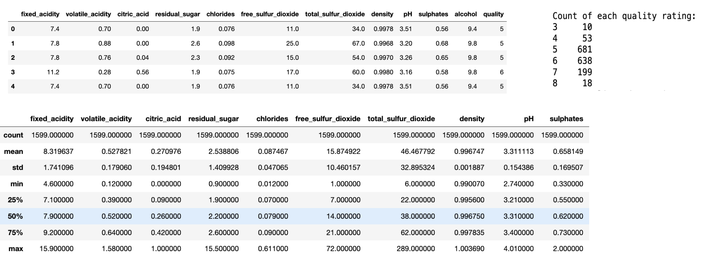

## Project Overview:

This project focuses on predicting wine quality for red wine based on its chemical composition. Leveraging a dataset comprising of detailed chemical properties and quality ratings, advanced techniques such as Principal Component Analysis (PCA) and Linear Regression are utilized to uncover essential relationships. By distilling key insights, the model offers actionable insights for winemakers to optimize production processes and tailor offerings to consumer preferences. The project facilitates informed decision-making, ultimately enhancing the quality and marketability of wines in a dynamic and competitive market landscape.

## Introduction:

Winemaking now embraces the tools of modern data science. Using a dataset containing detailed chemical properties and quality ratings for red wines, our exploration begins with thorough data analysis followed by principal component analysis and regression modeling. The quality of red wines is influenced by various chemical properties and characteristics. Understanding these factors is crucial for producers to maintain and improve wine quality. This project utilizes machine learning techniques to analyze a dataset of red wine properties and predict wine quality based on these attributes.

## Accomplishments:

1. **Data Exploration:** The dataset containing various attributes of red wines was loaded and explored. Descriptive statistics were calculated to gain insights into the data on a more intricate level.

2. **Correlation Analysis & Feature Importance:** A correlation matrix was generated to identify relationships between different wine attributes and quality. Features with the highest correlations with quality were identified. The importance of features in predicting wine quality was determined using a Random Forest Regressor. The top features influencing quality were visualized using a bar plot and a Pairplot was created to visualize the relationship between selected features and wine quality.

3. **Dimensionality Reduction:** Principal Component Analysis (PCA) was performed to reduce the dimensionality of the dataset while preserving its variance. The cumulative explained variance of the principal components was analyzed as well.

4. **Regression Modeling:** Two regression models, Linear Regression and Lasso Regression, were implemented to predict wine quality based on the selected features. The models were trained and evaluated using training and test datasets.

5. **Model Evaluation:** The performance of the regression models was evaluated using R-squared scores and MSE, indicating their ability to explain the variance in wine quality.

## Observations:

To start off, I did some basic statistical analysis of the dataset which included the count, mean, standard deviation, min, max, and quartiles of the feature variables. In regard to the quality, or target variable, I found the number of each quality rating in the entire dataset. The most common quality rating was a 5, which is valid since it is the middle on a scale of 1-10 in which the wines were graded on.

No clear correlations between variables and quality in this Pairplot so deeper dive is necessary.

To get a better understanding of the relationships between the variables, I created a pairplot, correlation plot, and a feature importance plot as shown below. The pairplot was not very telling in terms of the relationships between the variables. However, the correlation plot was helpful in finding the strongest relationships between the variables. Alcohol, volatile acidity, and sulphates had the strongest correlations with quality, which happened to be 0.476, 0.391, and 0.251, respectively. Using RandomForestRegressor from sklearn, I was able to create a feature importance plot which makes it easy to visually see which features are of the most importance when it comes to quality. In this graph, alcohol, sulphates, and volatile acidity were the top 3, just as they were in the correlation plot.

## Principal Component Analysis (PCA):

For dimensionality reduction, I used principal component analysis. After using StandardScaler to scale and transform my dataset, I set the components value to 9. From here, I found the explained variance ratio. The first 9 principal components in my dataset captured 97.81% of the variance. The explained variance ratio is the following: 
[0.28173931, 0.1750827, 0.1409585, 0.11029387, 0.08720837, 0.05996439, 0.05307193, 0.03845061, 0.0313311]

Even though the first 5-6 principal components capture the majority of the variance in my dataset, I noticed that the linear regression model was slightly affected with its accuracy, so I decided to stick with 9 principal components.

## Linear Regression:

In the dataset preparation phase, after conducting PCA, the dependent variable "quality" and the principal components were extracted from the data frame. Following this, the dataset was split into training and testing sets with a 70-30 ratio. Subsequently, a linear regression model was trained on the scaled training data to predict wine quality. The model's coefficients, intercept, and R-squared values were computed to evaluate its performance on both the training and testing datasets. The intercept represents the baseline quality level, and the R-squared values indicate the proportion of variance in wine quality explained by the model, with the training data exhibiting a 0.3764 value and the test data showing 0.3024, suggesting some predictive ability with room for improvement. The coefficients for the linear regression equation are: 

[ 0.09403139, -0.33245944, 0.32539202, -0.04737761, 0.10365283, -0.00610071, -0.06042906, 0.07057064, -0.07715712]

The intercept value for the linear regression equation is: 5.640750670241287. While the model performs better on the training data compared to the test data, it suggests that the model captures some of the variability in wine quality but may not be fully capturing all relevant factors. The Mean Squared Error (MSE) on the training data is 0.4099, suggesting the model's ability to predict wine quality ratings accurately. However, on the test data, the MSE slightly increases to 0.4454, indicating a potential challenge in generalizing predictions to test instances.

## Lasso Regression:

In an attempt to get a better regression accuracy model, I implemented Lasso Regression. Features underwent transformation into polynomial features of degree 2 using PolynomialFeatures to capture potential nonlinear relationships. Following this, the dataset was divided into training and testing subsets with a ratio of 75% for training and 25% for testing, utilizing train_test_split. To enhance model convergence and performance, features were normalized using MinMaxScaler, scaling them within a specified range. Subsequently, a Lasso Regression model with cross-validated alpha selection (LassoCV) was trained on the normalized training data. R-squared scores were then calculated to evaluate the model's performance on both training and testing datasets. The R-squared score for the training data approximated 0.312, suggesting that around 31.2% of the variance in wine quality is explained by the model on the training set. Conversely, the R-squared score for the test data was approximately 0.344, indicating slightly improved performance on test data, with the model explaining around 34.4% of the variance in wine quality. Similar to the linear regression model, this suggests that the model, while demonstrating some predictive capability, may benefit from further refinement to better capture the complexities of wine quality prediction. The Mean Squared Error (MSE) on the training data is 0.4331, indicating the model's accuracy in predicting wine quality ratings. Conversely, the MSE on the test data slightly increases to 0.4706, suggesting a moderate decline in predictive performance when applied to new instances.

## Conclusion:

In conclusion, this project successfully employed advanced data science techniques to analyze a dataset of red wine properties and predict wine quality ratings through data exploration, correlation analysis, dimensionality reduction from PCA, and regression modeling. While the models showed some predictive capability, further refinement is warranted to enhance their performance and better capture the complexities of wine quality prediction, ultimately contributing to the ongoing evolution and competitiveness of the wine industry today.
